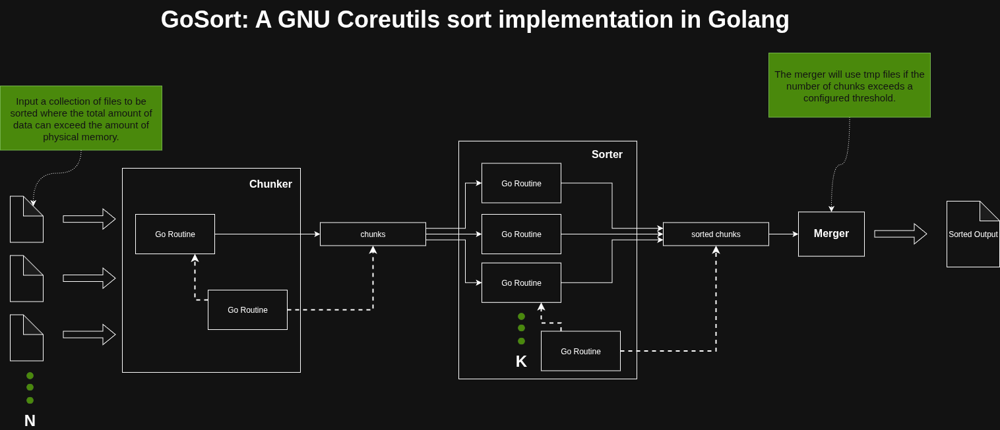

# gosort

## 💡About

This is a project I hack on from time to time with the goal of implementing the
GNU sort utility. It's more about the process and learning value than about
competing with GNU sort, but it's a fun exercise, and I'll continue to bring it
closer to feature and performance parity. For now, I hope you can learn
something from it, too.

## Next Steps
- Decouple the writing of tmp files from the sorter
- Introduce a strategy for when the sorted data fits completely into memory
- Investigate using a sync pool to relieve GC pressure

## ⚖️ License

This project is licensed under the MIT License. See the [LICENSE](LICENSE) file for details.
